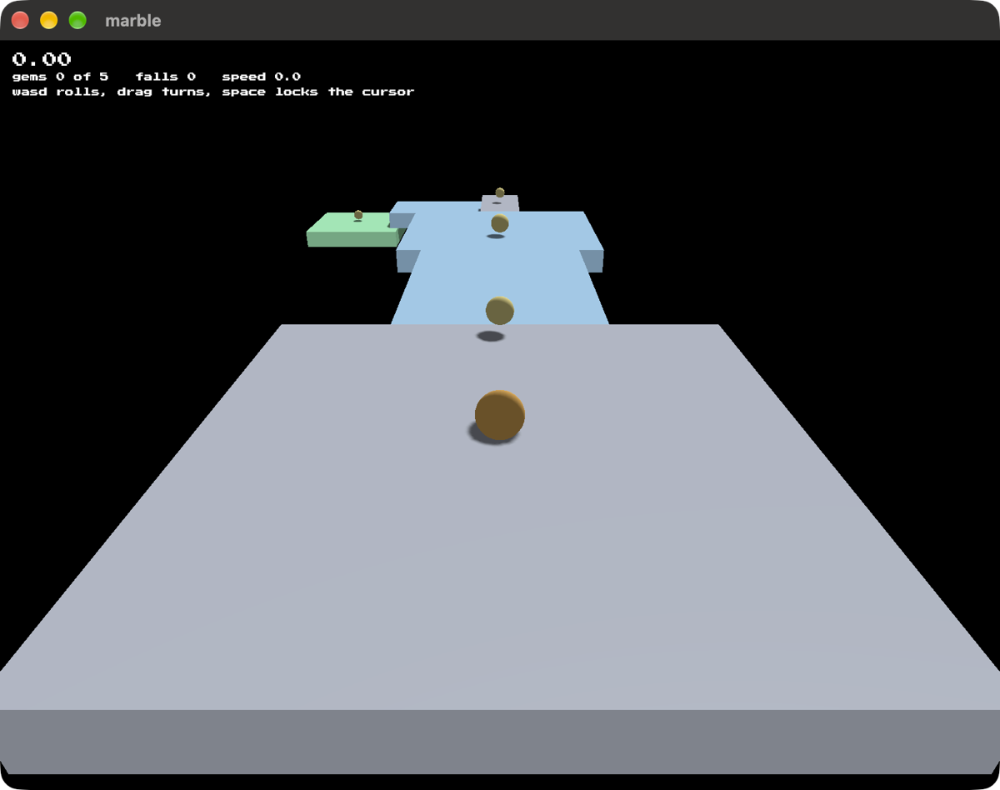

# marble

Roll a marble across a course of platforms to the goal, against a clock. The
first 3D game built on [blitzkit](https://github.com/jvalol/blitzkit).

## The project

Part of [blitzkit](https://github.com/jvalol/blitzkit), a graphics engine in
Rust and the games built on it: [pong](https://github.com/jvalol/pong),
[snake](https://github.com/jvalol/snake),
[tetris](https://github.com/jvalol/tetris),
[marble](https://github.com/jvalol/marble) and
[slider](https://github.com/jvalol/slider).
